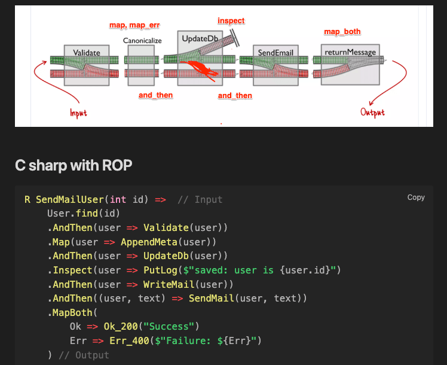

# RResult

[](https://github.com/ko-haya/RResult/actions/workflows/main.yml)

 A Result type for modelling 2way pipeline for C Sharp.

## Introduction

 The Result type is a monad type that holds return values and errors.
By holding the state after an operation, such as a function, in the Result type, the result of the execution can be clearly defined.
If an element T is found, the successful value can be retrieved from `Ok<T>`, and if an error is found, the failed result can be retrieved from `Err<E>`.
This avoids ambiguity in the handling of possible value absences such as `null`, or complications in the processing path due to exception throws.

The Result type of this project is represented as type `RResult`. The initials `R` are derived from `Rust` and `Railway Oriented Programming`.


## Gettings Started

```sh
dotnet add package RResult
```

This is a `FizzBuzz` with Result type.
It can be described in a declarative, flow-controlled, natural language alike, showing that it can be coded simply and robustly.
Full sample is `./example/RResult.FizzBuzz`

``` CSharp
    static void Main(string[] args) =>
        Console.WriteLine(
            string.Join(",", Enumerable.Range(1, 30).Select(Pipeline))
        );

    static string Pipeline(int i) =>
        DoDivide(i, 15, "FizzBuzz")
            .OrElse(it => DoDivide(it, 3, "Fizz"))
            .OrElse(it => DoDivide(it, 5, "Buzz"))
            .MapBoth(
                Ok => $"{Ok}",
                Err => $"{Err}"
            );

    static RResult<string, int> DoDivide(int dividend, int divisor, string sig) =>
        (dividend % divisor) switch
        {
            0 => sig,
            _ => dividend,
        };
```

### Transforming Results

Both success/error values can be converted through `Map` / `MapErr`.

``` CSharp
RResult<int, SomeErr>.Ok(3) // Ok(3)
    .Map(a => a * a) // Ok(9))
    // Also you can convert type int to string
    .Map(n => $"{n}") // OK("9")
```


### Mehod Chain

Results can be chain.



### Async Task Function

Also some functions are support AsyncFunction.
Will be fully compliant in the future.

- MapAsync / MapErrAsync
- InspectAsync / InspectErrAsync
- AndThenAsync / AndThenErrAsync

### Combine Result

Not currently supported, but will be in the future

### Inspiration

Inspiration for this library has been drawn:

- Rust
- kotlin-result

Improvements on existing solutions

- Feature parity with Result types from other languages including Rust
- Lax constraints on success value nullability
- Consistent naming with existing Result libraries from other languages (e.g. map, mapError, mapBoth, and, andThen, or, orElse, unwrap)
- Unit tests covering every library method

### Comparison table with other projects

| Function              | description                                                                                                                                                                                                                                                                                                                                                              | RResult | Rust | kotlin-result |
| --------------------- | ------------------------------------------------------------------------------------------------------------------------------------------------------------------------------------------------------------------------------------------------------------------------------------------------------------------------------------------------------------------------ | ------- | ---- | ------------- |
| Ok                    | Make Ok `Result` instance                                                                                                                                                                                                                                                                                                                                                | ✓       | ✓    | ✓             |
| Err                   | Make Error `Result` instance                                                                                                                                                                                                                                                                                                                                             | ✓       | ✓    | ✓             |
| isErr                 | Returns `true` if the result is [`Err`](https://doc.rust-lang.org/std/result/enum.Result.html#variant.Err "variant std::result::Result::Err").                                                                                                                                                                                                                           | ✓       | ✓    | ✓             |
| isOk                  | Returns `true` if the result is [`Ok`](https://doc.rust-lang.org/std/result/enum.Result.html#variant.Ok "variant std::result::Result::Ok").                                                                                                                                                                                                                              | ✓       | ✓    | ✓             |
| And                   | Returns `res` if the result is [`Ok`](https://doc.rust-lang.org/std/result/enum.Result.html#variant.Ok "variant std::result::Result::Ok"), otherwise returns the [`Err`](https://doc.rust-lang.org/std/result/enum.Result.html#variant.Err "variant std::result::Result::Err") value of `self`                                                                           | ✓       | ✓    | ✓             |
| Or                    | Returns `res` if the result is [`Err`](https://doc.rust-lang.org/std/result/enum.Result.html#variant.Err "variant std::result::Result::Err"), otherwise returns the [`Ok`](https://doc.rust-lang.org/std/result/enum.Result.html#variant.Ok "variant std::result::Result::Ok") value of `self`.                                                                          | ✓       | ✓    | ✓             |
| andThen               | Calls `op` if the result is [`Ok`](https://doc.rust-lang.org/std/result/enum.Result.html#variant.Ok "variant std::result::Result::Ok"), otherwise returns the [`Err`](https://doc.rust-lang.org/std/result/enum.Result.html#variant.Err "variant std::result::Result::Err") value of `self`.<br><br>This function can be used for control flow based on `Result` values. | ✓       | ✓    | ✓             |
| orElse                | Calls `op` if the result is [`Err`](https://doc.rust-lang.org/std/result/enum.Result.html#variant.Err "variant std::result::Result::Err"), otherwise returns the [`Ok`](https://doc.rust-lang.org/std/result/enum.Result.html#variant.Ok "variant std::result::Result::Ok") value of `self`.                                                                             | ✓       | ✓    | ✓             |
| unwrap                | Returns the contained [`Ok`](https://doc.rust-lang.org/std/result/enum.Result.html#variant.Err "variant std::result::Result::Err") value, consuming the `self` value.                                                                                                                                                                                                    | ✓       | ✓    | ✓             |
| unwrapErr             | Returns the contained [`Err`](https://doc.rust-lang.org/std/result/enum.Result.html#variant.Err "variant std::result::Result::Err") value, consuming the `self` value.                                                                                                                                                                                                   | ✓       | ✓    |               |
| Map                   | Maps a `Result<T, E>` to `Result<U, E>` by applying a function to a contained [`Ok`](https://doc.rust-lang.org/std/result/enum.Result.html#variant.Ok "variant std::result::Result::Ok") value, leaving an [`Err`](https://doc.rust-lang.org/std/result/enum.Result.html#variant.Err "variant std::result::Result::Err") value untouched.                                | ✓       | ✓    | ✓             |
| Inspect               | Calls a function with a reference to the contained value if Ok                                                                                                                                                                                                                                                                                                           | ✓       | ✓    | ✓             |
| InspectErr            | Calls a function with a reference to the contained value if Erro                                                                                                                                                                                                                                                                                                         | ✓       | ✓    | ✓             |
| ToResultOr            | Covert Result Or                                                                                                                                                                                                                                                                                                                                                         | TBD     |      | ✓             |
| RunCatching, mapError | Catch exception and return e.message                                                                                                                                                                                                                                                                                                                                     | TBD     |      | ✓             |


## Contributing

Bug reports and pull requests are welcome on [GitHub][github].

## License

This project is available under the terms of the Apache ver 2.0 license. See the
[`LICENSE`](LICENSE) file for the copyright information and licensing terms.
